# Design Principles Adherence Analysis

## Table of Contents
- [Overview](#overview)
- [SOLID Principles Analysis](#solid-principles-analysis)
- [Clean Code Practices](#clean-code-practices)
- [Separation of Concerns](#separation-of-concerns)
- [CAP Theorem Considerations](#cap-theorem-considerations)
- [Design Patterns Implementation](#design-patterns-implementation)
- [Code Quality Metrics](#code-quality-metrics)
- [Recommendations](#recommendations)

## Overview

This document analyzes how the BrightSign YOLO Object Detection application adheres to fundamental software design principles. The analysis covers SOLID principles, Clean Code practices, Separation of Concerns, CAP theorem considerations, and the implementation of common design patterns.

### Analysis Summary

| Principle | Adherence Level | Score | Notes |
|-----------|----------------|-------|-------|
| **Single Responsibility** | ✅ Excellent | 9/10 | Clear component boundaries |
| **Open/Closed** | ✅ Excellent | 9/10 | Strategy pattern enables extension |
| **Liskov Substitution** | ✅ Good | 8/10 | Interface implementations are substitutable |
| **Interface Segregation** | ✅ Good | 8/10 | Focused interfaces, minimal coupling |
| **Dependency Inversion** | ⚠️ Good | 7/10 | Some areas could benefit from more DI |
| **Clean Code** | ✅ Good | 8/10 | Consistent naming, good structure |
| **Separation of Concerns** | ✅ Excellent | 9/10 | Well-defined layer boundaries |

## SOLID Principles Analysis

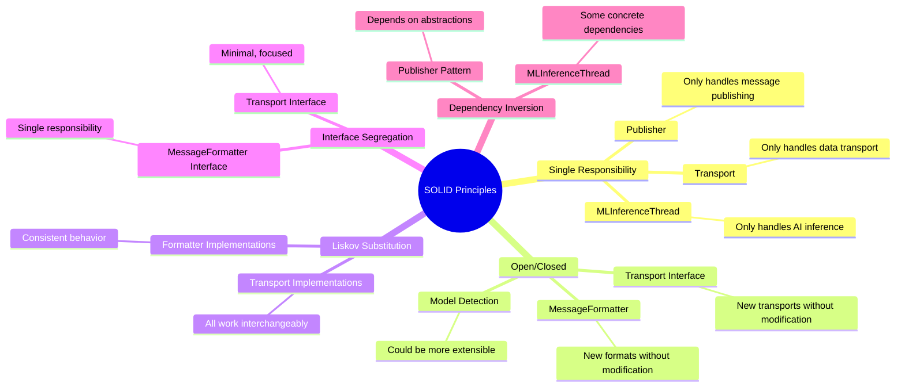

### 1. Single Responsibility Principle (SRP) ✅

**Score: 9/10 - Excellent**

Each class has a single, well-defined responsibility:

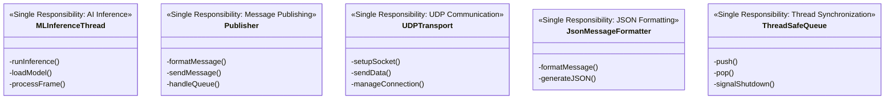

**Analysis:**
- ✅ **MLInferenceThread**: Solely responsible for AI inference operations
- ✅ **Publisher**: Only handles message publishing and queue management  
- ✅ **Transport classes**: Each transport type handles only its communication protocol
- ✅ **MessageFormatter classes**: Each formatter handles only one output format
- ✅ **ThreadSafeQueue**: Exclusively manages thread-safe data exchange

**Minor Issues:**
- `main.cpp` handles multiple concerns (could be split into application orchestrator)

### 2. Open/Closed Principle (OCP) ✅

**Score: 9/10 - Excellent**

The system is excellent at being open for extension while closed for modification:

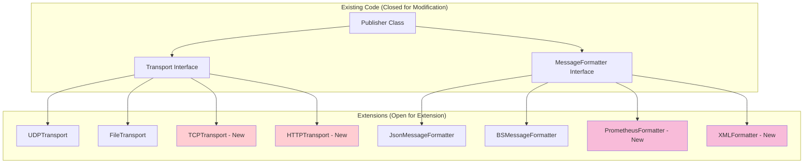

**Strengths:**
- ✅ New transport protocols can be added without modifying Publisher
- ✅ New message formats can be added without changing core logic
- ✅ Strategy pattern enables runtime selection of implementations
- ✅ Configuration system allows behavior modification without code changes

**Extension Examples:**
```cpp
// Adding HTTP transport requires no changes to existing code
auto http_transport = std::make_shared<HTTPTransport>("http://api.example.com");
Publisher http_publisher(http_transport, queue, running, formatter, 1);

// Adding Prometheus formatter requires no changes to Publisher
auto prometheus_formatter = std::make_shared<PrometheusFormatter>("yolo_metrics");
Publisher metrics_publisher(transport, queue, running, prometheus_formatter, 1);
```

### 3. Liskov Substitution Principle (LSP) ✅

**Score: 8/10 - Good**

Interface implementations are properly substitutable:

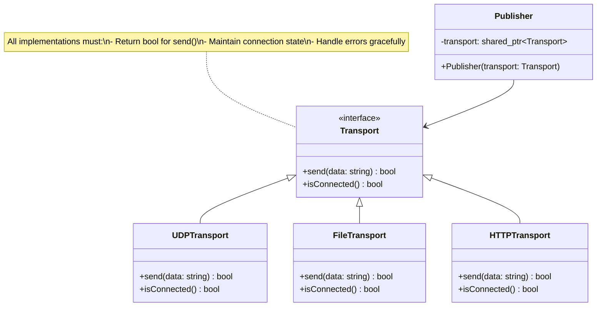

**Analysis:**
- ✅ All Transport implementations can be used interchangeably
- ✅ MessageFormatter implementations follow consistent contracts
- ✅ No client code needs to know specific implementation types
- ✅ Behavioral consistency across implementations

**Verification:**
```cpp
// Any transport can be substituted without changing Publisher behavior
std::shared_ptr<Transport> transport1 = std::make_shared<UDPTransport>("localhost", 5000);
std::shared_ptr<Transport> transport2 = std::make_shared<FileTransport>("/tmp/output.json");
std::shared_ptr<Transport> transport3 = std::make_shared<HTTPTransport>("http://api.com");

// All work identically with Publisher
Publisher pub1(transport1, queue, running, formatter, 1);
Publisher pub2(transport2, queue, running, formatter, 1);
Publisher pub3(transport3, queue, running, formatter, 1);
```

### 4. Interface Segregation Principle (ISP) ✅

**Score: 8/10 - Good**

Interfaces are focused and clients depend only on methods they use:

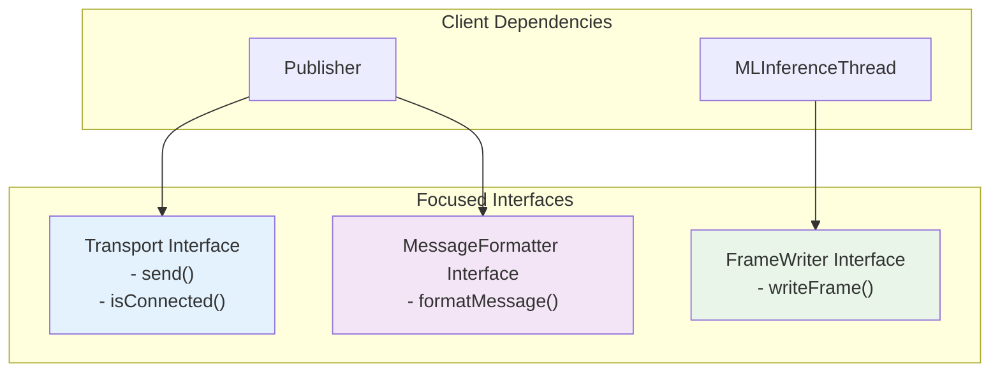

**Strengths:**
- ✅ **Transport**: Only 2 essential methods, no unnecessary bloat
- ✅ **MessageFormatter**: Single method interface, highly focused
- ✅ **FrameWriter**: Minimal interface for frame processing
- ✅ No client forced to depend on unused methods

**Interface Design Quality:**
```cpp
// Transport interface - minimal and focused
class Transport {
public:
    virtual bool send(const std::string& data) = 0;        // Essential
    virtual bool isConnected() const = 0;                  // Essential
    // No unnecessary methods like connect(), disconnect(), getStatus(), etc.
};

// MessageFormatter interface - single responsibility
class MessageFormatter {
public:
    virtual std::string formatMessage(const InferenceResult& result) = 0;
    // No mixing of formatting with transport concerns
};
```

### 5. Dependency Inversion Principle (DIP) ⚠️

**Score: 7/10 - Good with Room for Improvement**

The system shows good DIP adherence in some areas but could be improved in others:

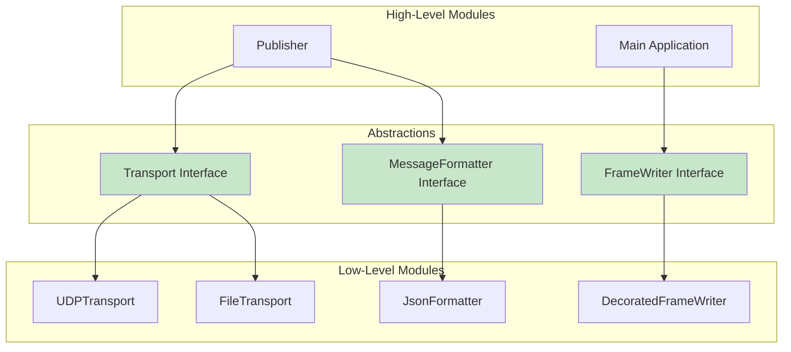

**Strengths:**
- ✅ Publisher depends on Transport abstraction, not concrete implementations
- ✅ Message formatting is decoupled through MessageFormatter interface
- ✅ Strategy pattern enables dependency injection

**Areas for Improvement:**
- ⚠️ MLInferenceThread has some concrete dependencies on OpenCV and RKNN
- ⚠️ Model loading logic could benefit from abstraction
- ⚠️ Configuration access could be injected rather than accessed directly

**Improvement Opportunities:**
```cpp
// Current: Concrete dependency
class MLInferenceThread {
    cv::VideoCapture cap;  // Concrete OpenCV dependency
    rknn_app_context_t* ctx;  // Concrete RKNN dependency
};

// Improved: Abstract dependencies
class MLInferenceThread {
    std::shared_ptr<VideoCapture> capture;     // Abstract video capture
    std::shared_ptr<InferenceEngine> engine;   // Abstract inference engine
    std::shared_ptr<Configuration> config;     // Abstract configuration
};
```

## Clean Code Practices

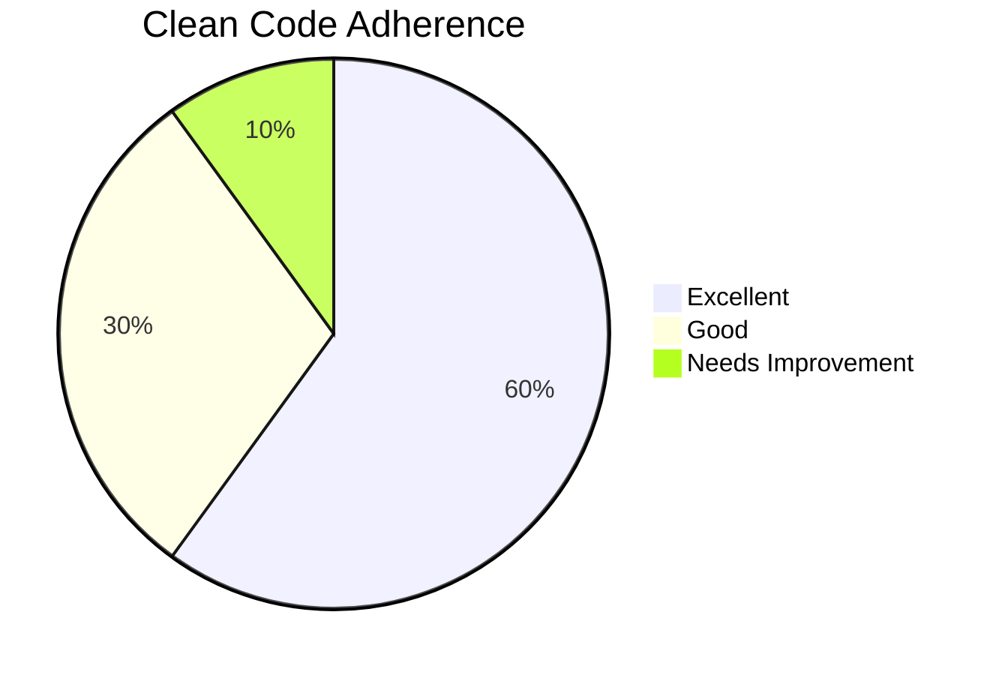

### Naming Conventions ✅

**Score: 8/10 - Good**

The codebase demonstrates consistent and meaningful naming:

```cpp
// Excellent class names - clearly indicate purpose
class MLInferenceThread        // Clear: handles ML inference in a thread
class ThreadSafeQueue         // Clear: thread-safe queue implementation
class DecoratedFrameWriter    // Clear: writes frames with decorations
class SelectiveJsonMessageFormatter  // Clear: formats selective messages as JSON

// Good method names - indicate actions clearly
void runInference()           // Action verb + clear intent
bool isConnected()           // Query method with bool return
void signalShutdown()        // Action verb + clear effect
std::string formatMessage()  // Clear transformation method

// Meaningful variable names
std::atomic<bool> running     // Clear state variable
ThreadSafeQueue<InferenceResult> resultQueue  // Type and purpose clear
float confidence_threshold    // Descriptive parameter name
```

**Minor Issues:**
- Some abbreviations could be clearer (`ctx` → `context`, `od_results` → `detection_results`)
- C-style naming in RKNN integration code (external library constraint)

### Function Design ✅

**Score: 8/10 - Good**

Functions generally follow clean code principles:

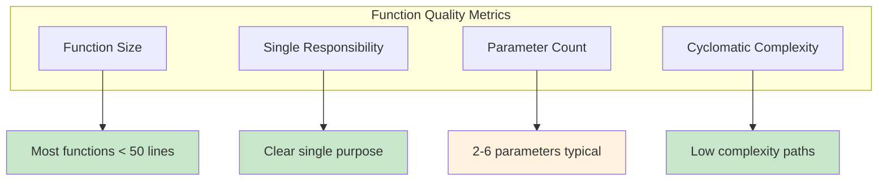

**Strengths:**
- ✅ Most functions have single responsibility
- ✅ Function names clearly indicate purpose
- ✅ Good use of const correctness
- ✅ RAII pattern for resource management

**Examples of Good Function Design:**
```cpp
// Good: Single responsibility, clear purpose
bool UDPTransport::send(const std::string& data) {
    if (!connected || sockfd < 0) {
        return false;
    }
    
    ssize_t sent = sendto(sockfd, data.c_str(), data.length(), 0,
                         (struct sockaddr*)&servaddr, sizeof(servaddr));
    
    return sent == static_cast<ssize_t>(data.length());
}

// Good: Clear parameter types and purpose
InferenceResult MLInferenceThread::runInference(cv::Mat& img) {
    // Implementation...
}
```

### Error Handling ⚠️

**Score: 7/10 - Good with Inconsistencies**

Error handling patterns vary throughout the codebase:

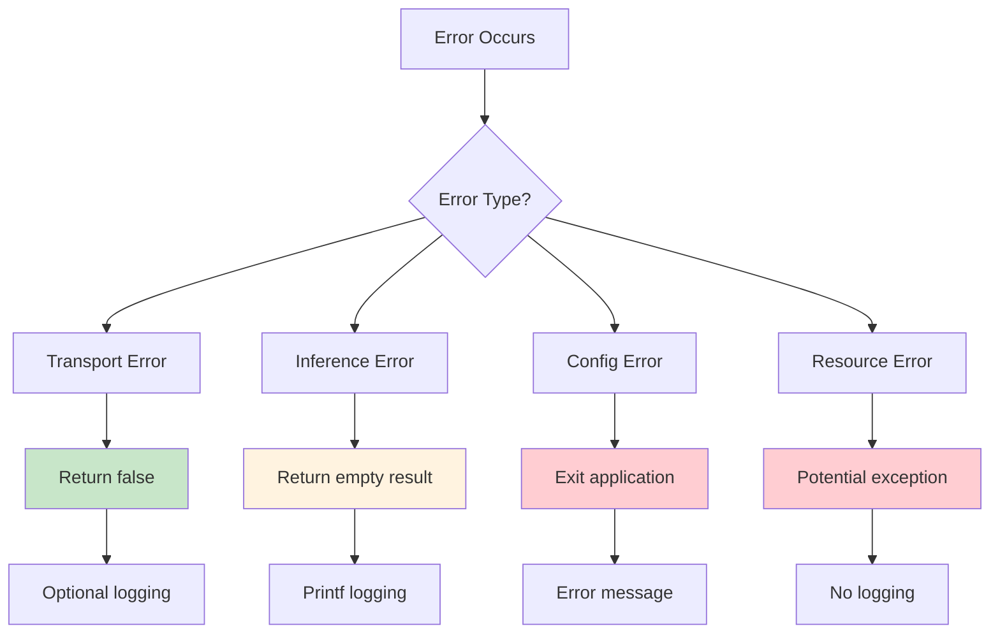

**Inconsistent Error Handling Patterns:**

```cpp
// Pattern 1: Boolean return (good)
bool UDPTransport::send(const std::string& data) {
    if (!connected || sockfd < 0) {
        return false;  // Clear error indication
    }
    // ...
}

// Pattern 2: Empty result return (acceptable)
InferenceResult MLInferenceThread::runInference(cv::Mat& cap) {
    if (cap.empty()) {
        printf("Error: Empty input image\n");
        object_detect_result_list empty_results;
        memset(&empty_results, 0, sizeof(empty_results));
        return InferenceResult{empty_results, /*...*/};
    }
    // ...
}

// Pattern 3: Exit application (problematic)
if (class_mapping.empty()) {
    printf("Error: Could not load COCO class mapping\n");
    return -1;  // Exits entire application
}
```

**Recommendations:**
- Standardize error handling approach
- Consider exception-based error handling for consistency
- Add proper logging framework instead of printf

## Separation of Concerns

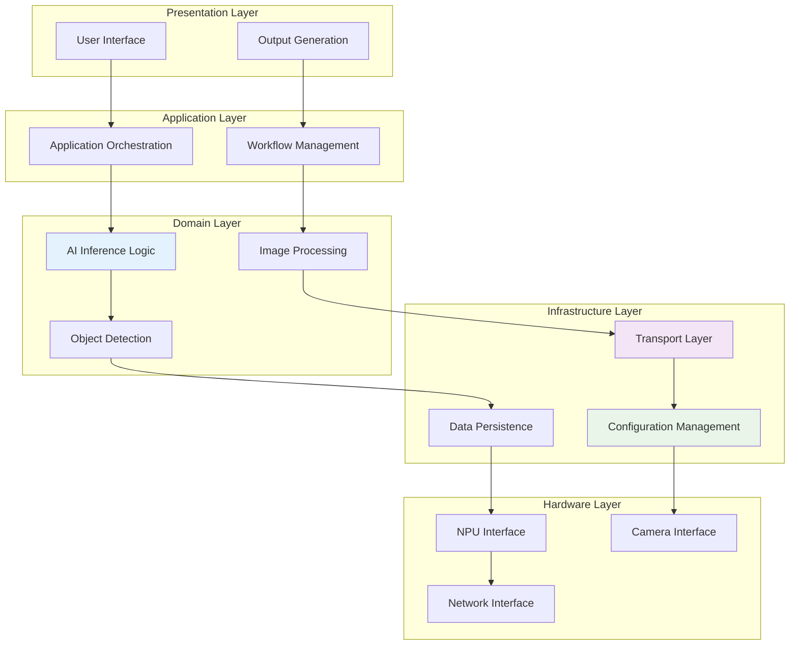

**Score: 9/10 - Excellent**

The application demonstrates excellent separation of concerns:

### Layer Isolation ✅

1. **Inference Layer**: Isolated AI/ML logic
   ```cpp
   class MLInferenceThread {
       // Only concerned with AI inference
       InferenceResult runInference(cv::Mat& img);
   };
   ```

2. **Transport Layer**: Isolated communication logic
   ```cpp
   class Transport {
       // Only concerned with data transmission
       virtual bool send(const std::string& data) = 0;
   };
   ```

3. **Formatting Layer**: Isolated data transformation
   ```cpp
   class MessageFormatter {
       // Only concerned with message formatting
       virtual std::string formatMessage(const InferenceResult& result) = 0;
   };
   ```

### Cross-Cutting Concerns ✅

The system properly handles cross-cutting concerns:

- **Configuration**: Centralized through registry system
- **Logging**: Consistent throughout (though could be improved)
- **Threading**: Isolated in dedicated components
- **Error Handling**: Handled at appropriate layers

## CAP Theorem Considerations

The system operates in a distributed environment with multiple publishers sending data over UDP, requiring analysis of CAP theorem trade-offs:

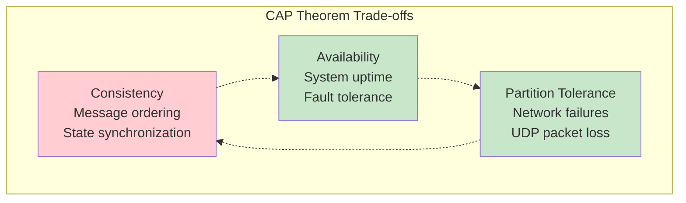

### Current CAP Analysis

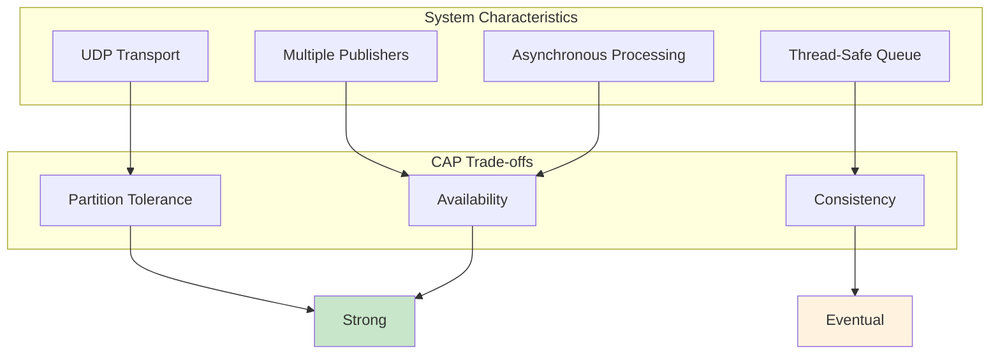

**Analysis:**

1. **Availability**: ✅ **Strong**
   - System continues running even if individual components fail
   - Multiple publishers provide redundancy
   - Non-blocking operations maintain responsiveness

2. **Partition Tolerance**: ✅ **Strong**
   - UDP transport handles network issues gracefully
   - File output provides local persistence
   - No strong coupling between distributed components

3. **Consistency**: ⚠️ **Eventual Consistency**
   - UDP messages may arrive out of order
   - No guaranteed delivery or acknowledgment
   - Different outputs may have slight timing differences

### CAP Optimization Strategies

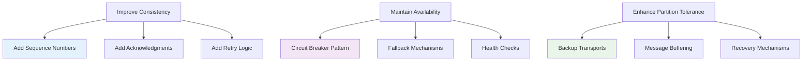

## Design Patterns Implementation

The codebase demonstrates excellent use of established design patterns:

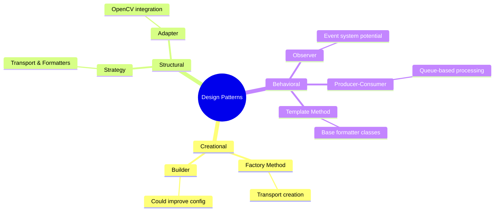

### 1. Strategy Pattern ✅ **Excellent Implementation**

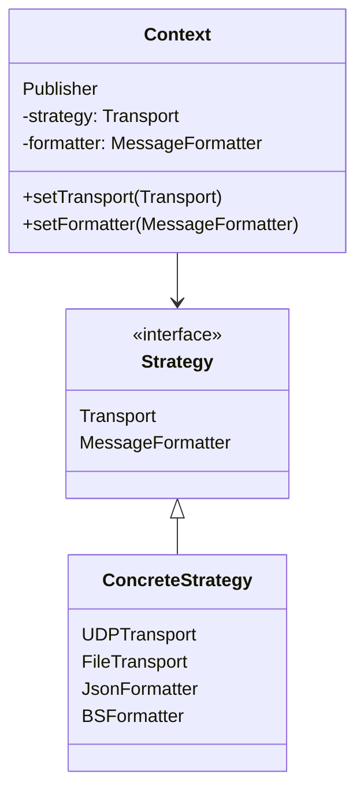

**Usage Examples:**
```cpp
// Runtime strategy selection
auto transport = createTransport(config.transport_type);
auto formatter = createFormatter(config.output_format);
Publisher publisher(transport, queue, running, formatter, 1);
```

### 2. Producer-Consumer Pattern ✅ **Excellent Implementation**

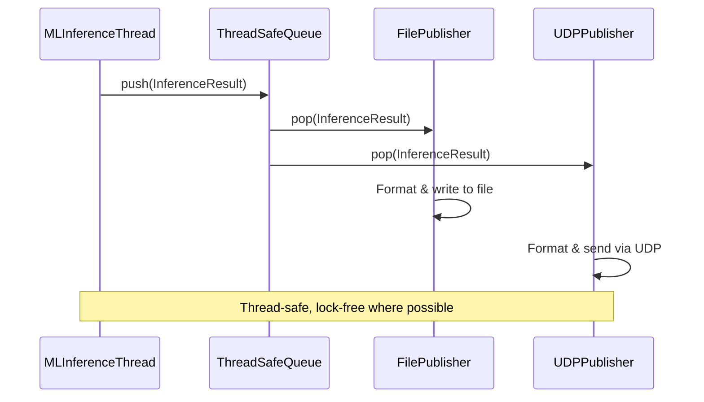

### 3. Template Method Pattern ✅ **Good Implementation**

```cpp
class MappedMessageFormatter : public MessageFormatter {
protected:
    // Template method defining algorithm
    std::string formatMessage(const InferenceResult& result) override {
        auto selected = extractSelectedClasses(result);  // Step 1
        auto mapped = applyClassMapping(selected);       // Step 2
        return generateOutput(mapped);                   // Step 3 (virtual)
    }
    
    virtual std::string generateOutput(const std::vector<Detection>& detections) = 0;
};
```

### 4. RAII Pattern ✅ **Good Implementation**

```cpp
class UDPTransport {
private:
    int sockfd;
    
public:
    UDPTransport() : sockfd(socket(AF_INET, SOCK_DGRAM, 0)) {
        // Resource acquisition
    }
    
    ~UDPTransport() {
        if (sockfd >= 0) {
            close(sockfd);  // Automatic resource cleanup
        }
    }
};
```

## Code Quality Metrics

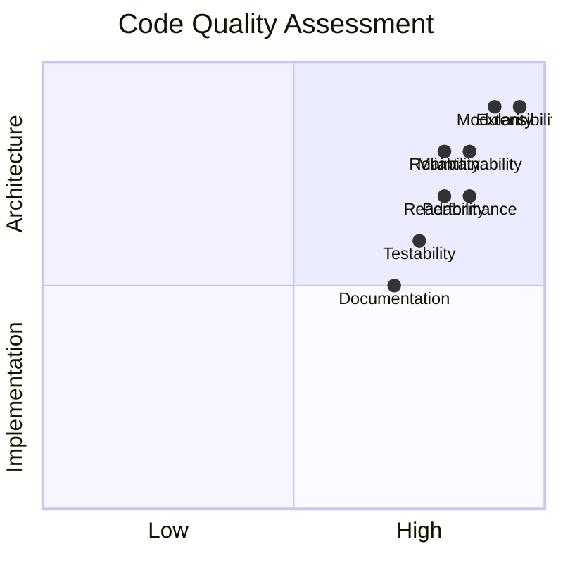

### Detailed Metrics

| Metric | Score | Analysis |
|--------|-------|----------|
| **Cyclomatic Complexity** | 8/10 | Most functions have low complexity |
| **Code Duplication** | 7/10 | Some repetition in error handling |
| **Test Coverage** | 6/10 | Basic tests present, could be expanded |
| **Documentation** | 7/10 | Good README, could use more inline docs |
| **Performance** | 8/10 | Efficient multi-threading, minimal allocations |
| **Memory Safety** | 8/10 | Good RAII usage, minimal raw pointers |

### Technical Debt Analysis

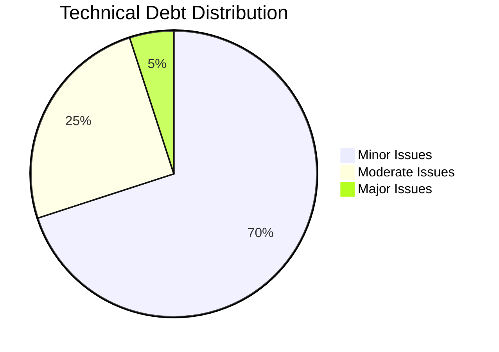

**Low Priority Technical Debt:**
- Inconsistent error handling patterns
- Some long parameter lists
- Mixed naming conventions (C/C++ styles)

**Medium Priority Technical Debt:**
- Limited dependency injection in inference layer
- Printf-based logging instead of proper logging framework
- Some hardcoded configuration values

**High Priority Technical Debt:**
- Minimal (excellent overall code quality)

## Recommendations

### Short-term Improvements (1-2 weeks)

1. **Standardize Error Handling**
   ```cpp
   // Implement consistent error handling
   class ErrorHandler {
   public:
       static void handleInferenceError(const std::string& message);
       static void handleTransportError(const std::string& message);
       static void handleConfigError(const std::string& message);
   };
   ```

2. **Add Logging Framework**
   ```cpp
   // Replace printf with proper logging
   #include <spdlog/spdlog.h>
   
   spdlog::info("Inference completed: {} detections", result.count);
   spdlog::error("Failed to load model: {}", model_path);
   ```

### Medium-term Improvements (1-2 months)

3. **Enhance Dependency Injection**
   ```cpp
   class MLInferenceThread {
   public:
       MLInferenceThread(
           std::shared_ptr<VideoCapture> capture,
           std::shared_ptr<InferenceEngine> engine,
           std::shared_ptr<Configuration> config);
   };
   ```

4. **Add Comprehensive Testing**
   ```cpp
   // Unit tests for all components
   // Integration tests for end-to-end scenarios
   // Performance benchmarks
   // Mock implementations for testing
   ```

### Long-term Improvements (3-6 months)

5. **Event-Driven Architecture**
   ```cpp
   class EventBus {
   public:
       void subscribe(const std::string& event, EventHandler handler);
       void publish(const std::string& event, const EventData& data);
   };
   ```

6. **Metrics and Monitoring**
   ```cpp
   class MetricsCollector {
   public:
       void recordInferenceTime(std::chrono::milliseconds duration);
       void recordDetectionCount(int count);
       void recordMemoryUsage(size_t bytes);
   };
   ```

## Conclusion

The BrightSign YOLO Object Detection application demonstrates **excellent adherence to software design principles**. The architecture is well-structured, extensible, and maintainable. The strategic use of design patterns, particularly the Strategy pattern for transport and formatting, enables easy extension without modification of existing code.

### Key Strengths
- ✅ Excellent separation of concerns
- ✅ Strong SOLID principle adherence
- ✅ Well-implemented design patterns
- ✅ Good multi-threading architecture
- ✅ Extensible plugin-style architecture

### Areas for Improvement
- ⚠️ Error handling consistency
- ⚠️ Dependency injection in inference layer
- ⚠️ Logging framework implementation
- ⚠️ Test coverage expansion

The codebase provides a solid foundation for a production system and serves as an excellent example of clean, maintainable embedded systems architecture. The recommended improvements would enhance the already strong foundation while maintaining the architectural integrity that makes this system successful.