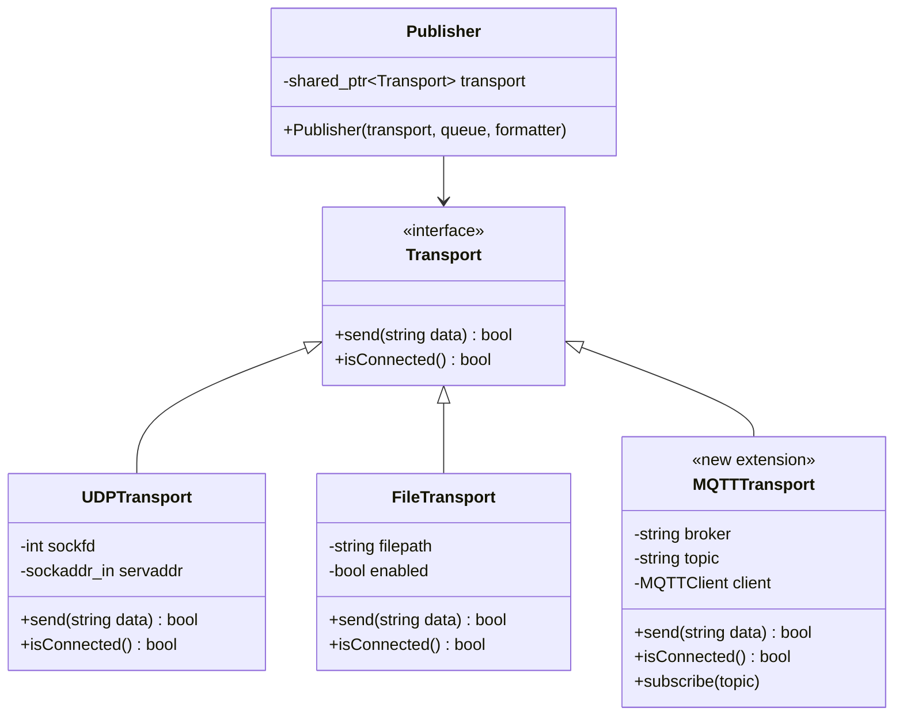
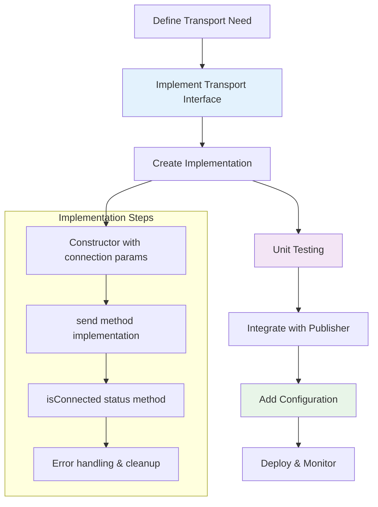
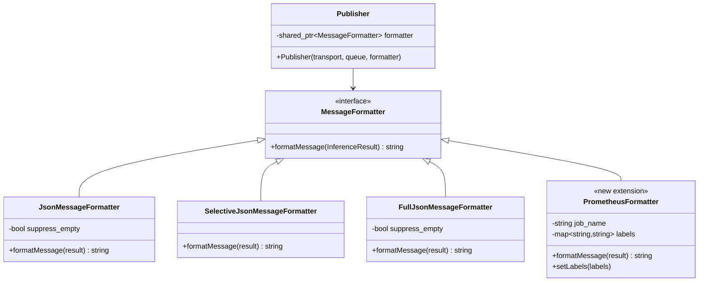
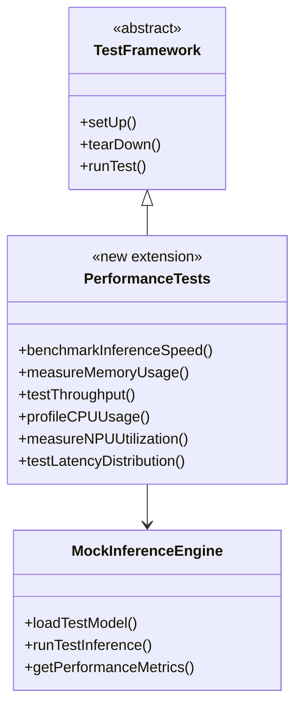

# Integration and Extension Points

## Table of Contents

- [Overview](#overview)
- [Transport Layer Extensions](#transport-layer-extensions)
- [Message Formatter Extensions](#message-formatter-extensions)
- [Performance Testing Extensions](#performance-testing-extensions)

## Overview

The BrightSign Object Detection application is architected with well-defined extension points that enable developers to customize behavior, add new functionality, and integrate with external systems. The design follows the Open/Closed Principle, allowing extensions without modifying existing code.

### Key Extension Categories

- **Transport Layer**: Add new communication protocols
- **Message Formatters**: Create custom output formats
- **Performance Testing**: Validate system performance and reliability
- **Integration Patterns**: Common patterns for system integration

## Transport Layer Extensions

The Transport layer uses the Strategy pattern to enable pluggable communication mechanisms.



### Adding MQTT Transport Protocol

The following example demonstrates how to add MQTT support to the system by implementing the Transport interface.

#### MQTT Transport Implementation

```cpp
// include/transports/mqtt_transport.h
#pragma once
#include "transport.h"
#include "MQTTClient.h"
#include <string>
#include <memory>

class MQTTTransport : public Transport {
private:
    MQTTClient client;
    std::string broker_url;
    std::string publish_topic;
    std::string client_id;
    bool connected;
    
    // MQTT callback for connection lost
    static void connectionLost(void* context, char* cause);
    
    // MQTT callback for message delivered
    static void messageDelivered(void* context, MQTTClient_deliveryToken token);
    
public:
    MQTTTransport(const std::string& broker, const std::string& topic, 
                  const std::string& client_id = "obj_detector");
    ~MQTTTransport();
    
    // Transport interface implementation
    bool send(const std::string& data) override;
    bool isConnected() const override;
    
    // MQTT-specific methods
    bool connect();
    void disconnect();
    void subscribe(const std::string& topic);
    void setQoS(int qos);
    void setRetained(bool retained);
};
```

```cpp
// src/transports/mqtt_transport.cpp
#include "mqtt_transport.h"
#include <iostream>
#include <chrono>

MQTTTransport::MQTTTransport(const std::string& broker, const std::string& topic, 
                             const std::string& client_id)
    : broker_url(broker), publish_topic(topic), client_id(client_id), connected(false) {
    
    // Initialize MQTT client
    int rc = MQTTClient_create(&client, broker_url.c_str(), client_id.c_str(),
                               MQTTCLIENT_PERSISTENCE_NONE, nullptr);
    
    if (rc != MQTTCLIENT_SUCCESS) {
        std::cerr << "Failed to create MQTT client, return code " << rc << std::endl;
        return;
    }
    
    // Set callbacks
    MQTTClient_setCallbacks(client, this, connectionLost, nullptr, messageDelivered);
    
    // Attempt initial connection
    connect();
}

MQTTTransport::~MQTTTransport() {
    if (connected) {
        disconnect();
    }
    MQTTClient_destroy(&client);
}

bool MQTTTransport::connect() {
    MQTTClient_connectOptions conn_opts = MQTTClient_connectOptions_initializer;
    conn_opts.keepAliveInterval = 20;
    conn_opts.cleansession = 1;
    
    int rc = MQTTClient_connect(client, &conn_opts);
    if (rc != MQTTCLIENT_SUCCESS) {
        std::cerr << "Failed to connect to MQTT broker, return code " << rc << std::endl;
        connected = false;
        return false;
    }
    
    connected = true;
    std::cout << "Connected to MQTT broker: " << broker_url << std::endl;
    return true;
}

void MQTTTransport::disconnect() {
    if (connected) {
        MQTTClient_disconnect(client, 10000);
        connected = false;
    }
}

bool MQTTTransport::send(const std::string& data) {
    if (!connected) {
        // Attempt to reconnect
        if (!connect()) {
            return false;
        }
    }
    
    MQTTClient_message pubmsg = MQTTClient_message_initializer;
    pubmsg.payload = (void*)data.c_str();
    pubmsg.payloadlen = data.length();
    pubmsg.qos = 1;
    pubmsg.retained = 0;
    
    MQTTClient_deliveryToken token;
    int rc = MQTTClient_publishMessage(client, publish_topic.c_str(), &pubmsg, &token);
    
    if (rc != MQTTCLIENT_SUCCESS) {
        std::cerr << "Failed to publish MQTT message, return code " << rc << std::endl;
        return false;
    }
    
    // Wait for delivery confirmation
    rc = MQTTClient_waitForCompletion(client, token, 1000);
    return rc == MQTTCLIENT_SUCCESS;
}

bool MQTTTransport::isConnected() const {
    return connected && MQTTClient_isConnected(client);
}

void MQTTTransport::connectionLost(void* context, char* cause) {
    auto* transport = static_cast<MQTTTransport*>(context);
    transport->connected = false;
    std::cerr << "MQTT connection lost: " << (cause ? cause : "Unknown reason") << std::endl;
}

void MQTTTransport::messageDelivered(void* context, MQTTClient_deliveryToken token) {
    // Message delivered successfully
}
```

#### Integration with Publisher

```cpp
// Usage example in main.cpp
#include "transports/mqtt_transport.h"

// Create MQTT transport for IoT integration
auto mqtt_transport = std::make_shared<MQTTTransport>(
    "tcp://mqtt.broker.com:1883",
    "sensors/objdet/detections",
    "brightsign_player_001"
);

// Create publisher with MQTT transport
Publisher mqtt_publisher(
    mqtt_transport,
    resultQueue,
    running,
    json_formatter,
    1  // Publish once per second
);

// Start MQTT publishing thread
std::thread mqtt_thread(std::ref(mqtt_publisher));
```

### Transport Extension Workflow



## Message Formatter Extensions

The MessageFormatter interface enables custom output formats for different integration scenarios.



### Adding Prometheus Metrics Formatter

The following example demonstrates how to add Prometheus metrics support for monitoring and observability.

#### Prometheus Formatter Implementation

```cpp
// include/formatters/prometheus_formatter.h
#pragma once
#include "publisher.h"
#include <string>
#include <map>
#include <sstream>
#include <unordered_map>

class PrometheusFormatter : public MessageFormatter {
private:
    std::string job_name;
    std::map<std::string, std::string> labels;
    
public:
    explicit PrometheusFormatter(const std::string& job = "object_detection") 
        : job_name(job) {}
    
    void setLabel(const std::string& key, const std::string& value) {
        labels[key] = value;
    }
    
    void setLabels(const std::map<std::string, std::string>& new_labels) {
        labels = new_labels;
    }
    
    std::string formatMessage(const InferenceResult& result) override {
        std::stringstream ss;
        
        // Count objects by class
        std::unordered_map<std::string, int> class_counts;
        for (int i = 0; i < result.detections.count; ++i) {
            const auto& detection = result.detections.results[i];
            if (detection.prop >= result.confidence_threshold) {
                class_counts[detection.name]++;
            }
        }
        
        // Generate Prometheus metrics in exposition format
        for (const auto& [class_name, count] : class_counts) {
            ss << "objdet_detections_total{";
            ss << "job=\"" << job_name << "\"";
            ss << ",class=\"" << class_name << "\"";
            
            // Add custom labels
            for (const auto& [key, value] : labels) {
                ss << "," << key << "=\"" << value << "\"";
            }
            
            ss << "} " << count << " " 
               << std::chrono::duration_cast<std::chrono::milliseconds>(
                   result.timestamp.time_since_epoch()).count() << "\n";
        }
        
        // Add summary metrics
        ss << "objdet_inference_total{job=\"" << job_name << "\"} 1 "
           << std::chrono::duration_cast<std::chrono::milliseconds>(
               result.timestamp.time_since_epoch()).count() << "\n";
        
        return ss.str();
    }
};
```

#### Integration with Monitoring Systems

```cpp
// Usage example for monitoring integration
#include "formatters/prometheus_formatter.h"

// Create Prometheus formatter with custom labels
auto prometheus_formatter = std::make_shared<PrometheusFormatter>("object_detection");
prometheus_formatter->setLabel("instance", "brightsign_player_001");
prometheus_formatter->setLabel("location", "retail_store_front");
prometheus_formatter->setLabel("model", "yolox_s");

// Create HTTP transport for Prometheus push gateway
auto http_transport = std::make_shared<HTTPTransport>("http://pushgateway:9091/metrics/job/objdet");

// Create publisher for metrics
Publisher metrics_publisher(
    http_transport,
    resultQueue,
    running,
    prometheus_formatter,
    5  // Push metrics every 5 seconds
);

// Start metrics publishing thread
std::thread metrics_thread(std::ref(metrics_publisher));
```

#### Sample Prometheus Output

```ini
objdet_detections_total{job="object_detection",class="person",instance="brightsign_player_001",location="retail_store_front",model="yolox_s"} 3 1674123456789
objdet_detections_total{job="object_detection",class="car",instance="brightsign_player_001",location="retail_store_front",model="yolox_s"} 1 1674123456789
objdet_inference_total{job="object_detection"} 1 1674123456789
```

This format is compatible with Prometheus monitoring systems and can be used for:

- **Alerting**: Set up alerts when object counts exceed thresholds
- **Dashboards**: Create Grafana dashboards showing detection trends
- **Capacity Planning**: Monitor system performance over time
- **A/B Testing**: Compare detection accuracy across different models

## Performance Testing Extensions

The existing test infrastructure provides extension points for performance validation and benchmarking.



### Adding Performance Tests

The following example demonstrates how to extend the testing framework with comprehensive performance benchmarks.

#### Performance Test Implementation

```cpp
// tests/performance_tests.h
#pragma once
#include "test_framework.h"
#include <chrono>
#include <vector>
#include <memory>

class PerformanceTests : public TestFramework {
private:
    std::unique_ptr<MLInferenceThread> inference_engine;
    std::vector<cv::Mat> test_images;
    
public:
    void setUp() override {
        // Load test model and images
        loadTestData();
        inference_engine = std::make_unique<MLInferenceThread>(
            "model/test_yolox_s.rknn",
            test_images,
            resultQueue,
            running
        );
    }
    
    void tearDown() override {
        inference_engine.reset();
        test_images.clear();
    }
    
    // Benchmark inference speed across multiple iterations
    void benchmarkInferenceSpeed() {
        const int iterations = 1000;
        auto start = std::chrono::high_resolution_clock::now();
        
        for (int i = 0; i < iterations; ++i) {
            auto result = inference_engine->runInference(test_images[i % test_images.size()]);
            ASSERT_GT(result.detections.count, 0) << "No detections in iteration " << i;
        }
        
        auto end = std::chrono::high_resolution_clock::now();
        auto duration = std::chrono::duration_cast<std::chrono::milliseconds>(end - start);
        
        double fps = (iterations * 1000.0) / duration.count();
        double avg_latency = duration.count() / static_cast<double>(iterations);
        
        std::cout << "Performance Results:" << std::endl;
        std::cout << "- Average FPS: " << fps << std::endl;
        std::cout << "- Average Latency: " << avg_latency << " ms" << std::endl;
        
        // Assert minimum performance requirements
        ASSERT_GT(fps, 25.0) << "FPS below minimum requirement of 25";
        ASSERT_LT(avg_latency, 40.0) << "Latency above maximum of 40ms";
    }
    
    // Measure memory usage patterns during inference
    void measureMemoryUsage() {
        size_t initial_memory = getCurrentMemoryUsage();
        size_t peak_memory = initial_memory;
        
        // Run extended processing with memory monitoring
        for (int i = 0; i < 100; ++i) {
            auto result = inference_engine->runInference(test_images[i % test_images.size()]);
            
            size_t current_memory = getCurrentMemoryUsage();
            peak_memory = std::max(peak_memory, current_memory);
            
            // Check for memory leaks every 10 iterations
            if (i % 10 == 0) {
                size_t current_baseline = getCurrentMemoryUsage();
                ASSERT_LT(current_baseline - initial_memory, 50 * 1024 * 1024) // 50MB max growth
                    << "Memory leak detected at iteration " << i;
            }
        }
        
        size_t final_memory = getCurrentMemoryUsage();
        size_t memory_growth = final_memory - initial_memory;
        size_t peak_usage = peak_memory - initial_memory;
        
        std::cout << "Memory Usage Results:" << std::endl;
        std::cout << "- Initial Memory: " << initial_memory / (1024*1024) << " MB" << std::endl;
        std::cout << "- Peak Memory: " << peak_memory / (1024*1024) << " MB" << std::endl;
        std::cout << "- Final Memory: " << final_memory / (1024*1024) << " MB" << std::endl;
        std::cout << "- Memory Growth: " << memory_growth / (1024*1024) << " MB" << std::endl;
        
        ASSERT_LT(memory_growth, 100 * 1024 * 1024) << "Memory growth exceeds 100MB limit";
        ASSERT_LT(peak_usage, 500 * 1024 * 1024) << "Peak memory usage exceeds 500MB limit";
    }
    
    // Test system throughput under load
    void testThroughput() {
        const int duration_seconds = 30;
        const auto start_time = std::chrono::steady_clock::now();
        const auto end_time = start_time + std::chrono::seconds(duration_seconds);
        
        int processed_frames = 0;
        int successful_detections = 0;
        
        while (std::chrono::steady_clock::now() < end_time) {
            auto result = inference_engine->runInference(
                test_images[processed_frames % test_images.size()]
            );
            
            processed_frames++;
            if (result.detections.count > 0) {
                successful_detections++;
            }
        }
        
        double throughput = processed_frames / static_cast<double>(duration_seconds);
        double detection_rate = successful_detections / static_cast<double>(processed_frames);
        
        std::cout << "Throughput Results:" << std::endl;
        std::cout << "- Processed Frames: " << processed_frames << std::endl;
        std::cout << "- Throughput: " << throughput << " FPS" << std::endl;
        std::cout << "- Detection Rate: " << (detection_rate * 100) << "%" << std::endl;
        
        ASSERT_GT(throughput, 20.0) << "Throughput below 20 FPS under sustained load";
        ASSERT_GT(detection_rate, 0.8) << "Detection rate below 80%";
    }
    
    // Profile CPU and NPU utilization
    void profileResourceUtilization() {
        auto cpu_usage_start = getCPUUtilization();
        auto npu_usage_start = getNPUUtilization();
        
        // Run inference workload
        const int test_duration = 10; // seconds
        auto start = std::chrono::steady_clock::now();
        auto end = start + std::chrono::seconds(test_duration);
        
        std::vector<double> cpu_samples;
        std::vector<double> npu_samples;
        
        while (std::chrono::steady_clock::now() < end) {
            auto result = inference_engine->runInference(test_images[0]);
            
            // Sample resource usage
            cpu_samples.push_back(getCPUUtilization());
            npu_samples.push_back(getNPUUtilization());
            
            std::this_thread::sleep_for(std::chrono::milliseconds(100));
        }
        
        // Calculate statistics
        double avg_cpu = std::accumulate(cpu_samples.begin(), cpu_samples.end(), 0.0) / cpu_samples.size();
        double avg_npu = std::accumulate(npu_samples.begin(), npu_samples.end(), 0.0) / npu_samples.size();
        
        double max_cpu = *std::max_element(cpu_samples.begin(), cpu_samples.end());
        double max_npu = *std::max_element(npu_samples.begin(), npu_samples.end());
        
        std::cout << "Resource Utilization Results:" << std::endl;
        std::cout << "- Average CPU: " << avg_cpu << "%" << std::endl;
        std::cout << "- Peak CPU: " << max_cpu << "%" << std::endl;
        std::cout << "- Average NPU: " << avg_npu << "%" << std::endl;
        std::cout << "- Peak NPU: " << max_npu << "%" << std::endl;
        
        // Validate efficient resource usage
        ASSERT_LT(avg_cpu, 80.0) << "CPU usage too high";
        ASSERT_GT(avg_npu, 30.0) << "NPU not being utilized effectively";
        ASSERT_LT(max_cpu, 95.0) << "CPU usage spikes too high";
    }
    
private:
    void loadTestData() {
        // Load test images for benchmarking
        test_images.push_back(cv::imread("tests/data/test_image1.jpg"));
        test_images.push_back(cv::imread("tests/data/test_image2.jpg"));
        
        for (auto& img : test_images) {
            ASSERT_FALSE(img.empty()) << "Failed to load test image";
        }
    }
    
    size_t getCurrentMemoryUsage() {
        // Platform-specific memory usage implementation
        #ifdef __linux__
        std::ifstream status("/proc/self/status");
        std::string line;
        while (std::getline(status, line)) {
            if (line.substr(0, 6) == "VmRSS:") {
                std::istringstream iss(line.substr(7));
                size_t memory_kb;
                iss >> memory_kb;
                return memory_kb * 1024; // Convert to bytes
            }
        }
        #endif
        return 0;
    }
    
    double getCPUUtilization() {
        // Platform-specific CPU utilization implementation
        return 0.0; // Placeholder
    }
    
    double getNPUUtilization() {
        // NPU utilization monitoring implementation
        return 0.0; // Placeholder
    }
};
```

#### Integration with Testing Framework

```cpp
// tests/CMakeLists.txt addition
add_executable(performance_tests
    performance_tests.cpp
    mock_inference_engine.cpp
    test_framework.cpp
)

target_link_libraries(performance_tests
    ${OpenCV_LIBS}
    ${RKNN_RT_LIB}
    gtest
    gtest_main
)

# Usage in main test runner
int main(int argc, char** argv) {
    ::testing::InitGoogleTest(&argc, argv);
    
    // Run performance tests separately for detailed reporting
    PerformanceTests perf_tests;
    perf_tests.setUp();
    
    std::cout << "=== Performance Benchmark Results ===" << std::endl;
    perf_tests.benchmarkInferenceSpeed();
    perf_tests.measureMemoryUsage();
    perf_tests.testThroughput();
    perf_tests.profileResourceUtilization();
    
    perf_tests.tearDown();
    
    return RUN_ALL_TESTS();
}
```

This performance testing framework enables comprehensive validation of system performance characteristics, helping ensure the object detection system meets real-time requirements across different deployment scenarios.