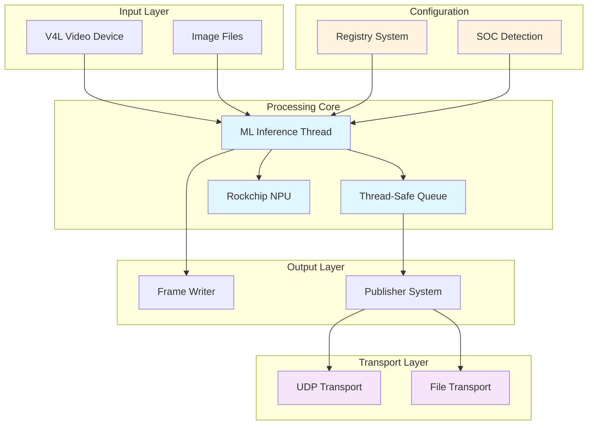
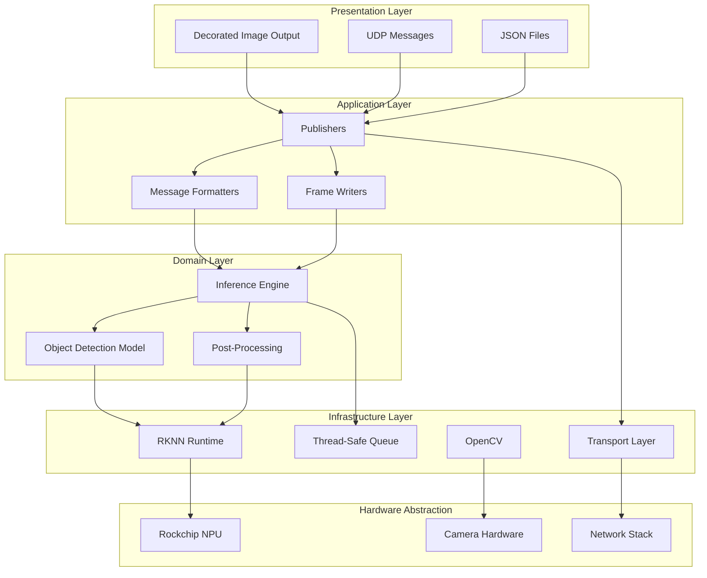
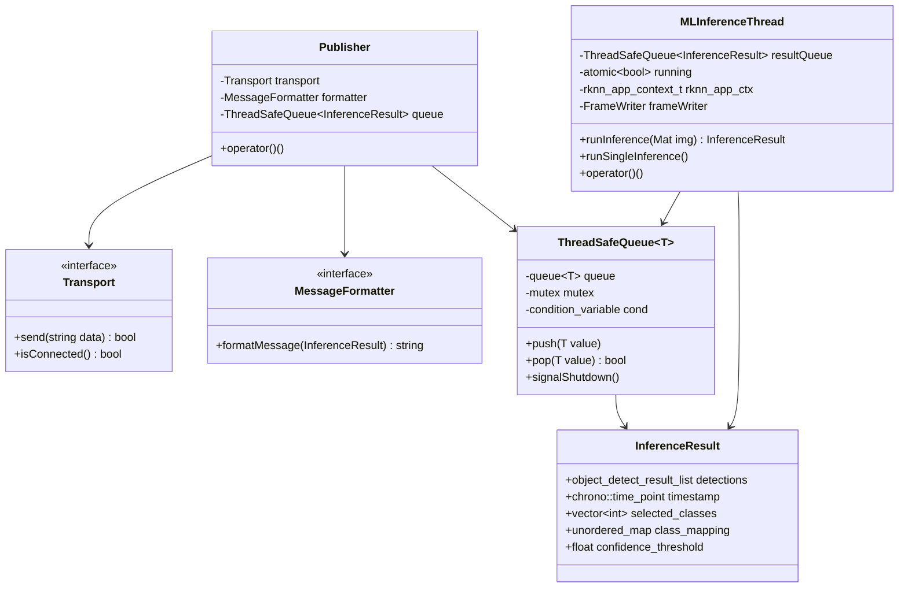
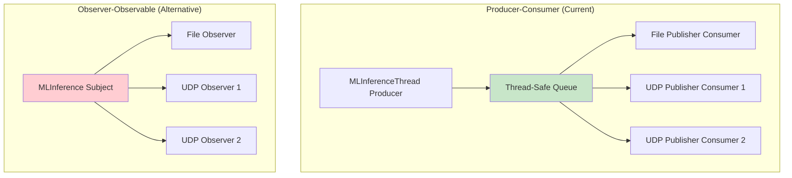
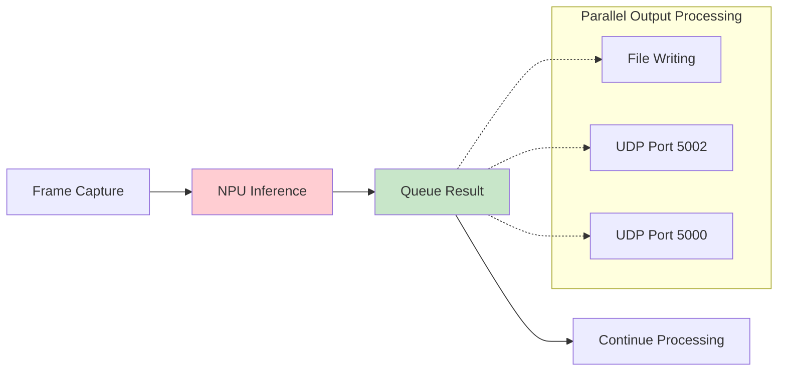
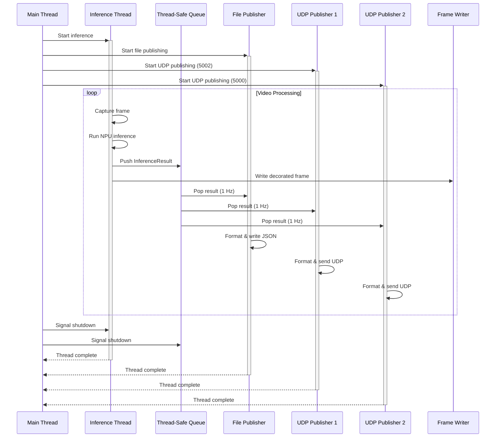
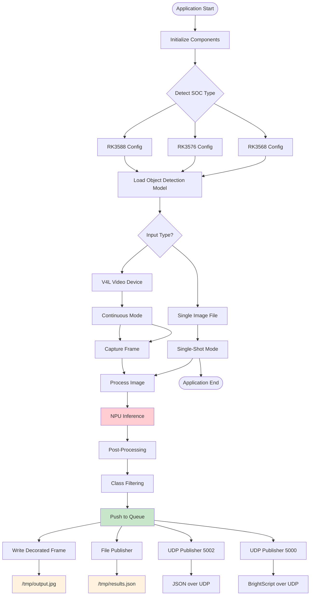
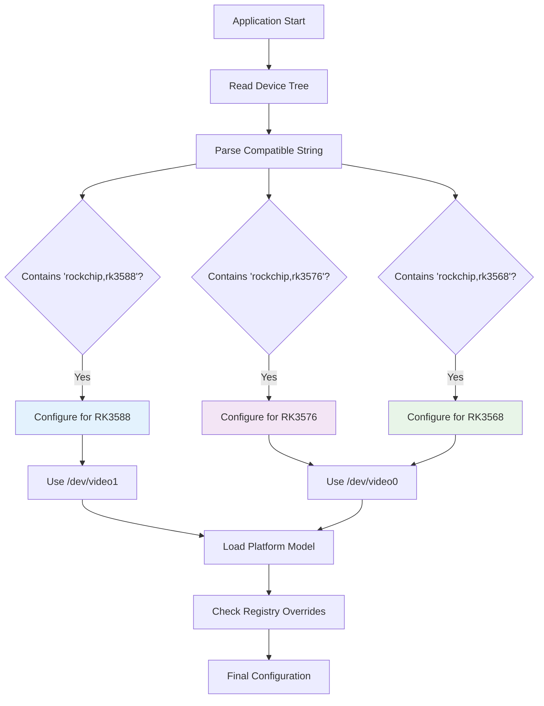
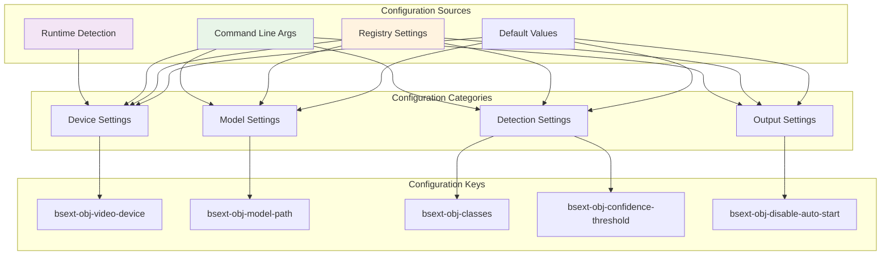

# Software Design and Architecture

## Table of Contents

- [Overview](#overview)
- [System Architecture](#system-architecture)
- [Layered Architecture](#layered-architecture)
- [Component Design](#component-design)
- [Threading Model](#threading-model)
- [Data Flow Architecture](#data-flow-architecture)
- [Multi-Platform Support](#multi-platform-support)
- [Configuration Architecture](#configuration-architecture)

## Overview

The BrightSign Object Detection application is a computer vision system designed for real-time object detection on BrightSign Players (embedded ARM-based hardware). The architecture features a clear separation of concerns, modular design, and extensible patterns.

### Key Architectural Characteristics

- **Layered Architecture**: Clean separation between inference, transport, formatting, and configuration
- **Producer-Consumer Pattern**: Thread-safe pipeline for processing video frames
- **Strategy Pattern**: Pluggable transport and formatting mechanisms
- **Multi-Platform Support**: Runtime detection and adaptation for different SOCs
- **Configurable Pipeline**: Registry-based configuration system

## System Architecture



## Layered Architecture

The application follows a clean layered architecture pattern with well-defined boundaries:



### Layer Responsibilities

1. **Presentation Layer**: Handles output formatting and delivery
2. **Application Layer**: Orchestrates business logic and data transformation
3. **Domain Layer**: Contains core AI/ML processing logic
4. **Infrastructure Layer**: Provides technical services and abstractions
5. **Hardware Abstraction**: Interfaces with physical hardware components

## Component Design

### Core Components



### Key Design Patterns

1. **Strategy Pattern**: Transport and MessageFormatter interfaces allow runtime selection
2. **Producer-Consumer**: MLInferenceThread produces, Publishers consume
3. **Template Method**: FrameWriter defines processing template
4. **Dependency Injection**: Publishers receive Transport and MessageFormatter dependencies

## Producer-Consumer Pattern Design Choice

The system implements a Producer-Consumer pattern rather than alternatives like Observer-Observable, and this choice is fundamental to the architecture's success in real-time computer vision processing.

### Pattern Comparison Analysis



### Why Producer-Consumer Was Chosen

| Aspect | Producer-Consumer ✅ | Observer-Observable ❌ |
|--------|---------------------|----------------------|
| **Threading Model** | Asynchronous, non-blocking producer | Synchronous callbacks block producer |
| **Backpressure Handling** | Built-in queue buffering | No flow control mechanism |
| **Failure Isolation** | Consumer failures don't affect producer | Observer exceptions can crash system |
| **Performance** | Lock-free operations where possible | Requires synchronized notification |
| **Scalability** | Easy to add consumers without code changes | Must modify subject to add observers |
| **Memory Management** | Controlled queue depth prevents memory spikes | Unbounded observer notifications |

### Real-Time Processing Benefits

#### 1. **Inference Pipeline Optimization**



The producer (inference thread) never blocks waiting for consumers, maintaining consistent ~30 FPS processing.

#### 2. **Backpressure Management**

```cpp
// ThreadSafeQueue handles backpressure automatically
template<typename T>
void ThreadSafeQueue<T>::push(T value) {
    std::lock_guard<std::mutex> lock(mutex);
    if (queue.size() >= max_depth) {
        queue.pop();  // Drop oldest result to maintain real-time performance
    }
    queue.push(std::move(value));
    cond.notify_one();
}
```

When consumers can't keep up, the queue drops old results rather than blocking the inference pipeline.

#### 3. **Failure Isolation**

- **Producer-Consumer**: If UDP publisher fails, file publisher continues working
- **Observer-Observable**: If one observer throws exception, it could crash the entire notification system

### Embedded System Advantages

#### Memory Efficiency

- **Fixed Queue Size**: Prevents memory bloat on embedded systems
- **RAII Management**: Automatic cleanup prevents memory leaks
- **Copy Avoidance**: Move semantics reduce memory allocation overhead

#### CPU Utilization

- **Thread Affinity**: Each consumer can run on dedicated cores
- **Lock Contention**: Minimized through careful queue design
- **Cache Locality**: Sequential queue operations improve cache performance

### Performance Characteristics

Producer-Consumer maintains better frame timing by decoupling output processing from inference.

### Architectural Trade-offs

#### Benefits ✅

- **Decoupling**: Producer and consumers are completely independent
- **Scalability**: Easy to add new output formats without affecting inference
- **Performance**: Non-blocking producer maintains real-time constraints
- **Reliability**: Consumer failures don't affect core processing
- **Memory Control**: Bounded queue prevents memory exhaustion

#### Considerations ⚠️

- **Latency**: Small additional latency due to queue buffering
- **Memory Usage**: Queue requires additional memory allocation
- **Complexity**: More complex than direct method calls

#### Optimal for Computer Vision ✅

- **Frame Rate Consistency**: Critical for real-time video processing
- **Multiple Output Formats**: Common requirement in vision applications
- **Embedded Constraints**: Memory and CPU limitations require careful design
- **Fault Tolerance**: Mission-critical applications need failure isolation

The Producer-Consumer pattern choice demonstrates thoughtful architectural decision-making, prioritizing real-time performance and system reliability over simplicity. This pattern is particularly well-suited to the demanding requirements of embedded computer vision systems.

## Threading Model

The application uses a sophisticated multi-threaded architecture for optimal performance:



### Thread Safety Mechanisms

1. **Atomic Variables**: Shared `running` flag for coordinated shutdown
2. **Thread-Safe Queue**: Mutex and condition variables protect shared data
3. **RAII Pattern**: Automatic resource cleanup in destructors
4. **Lock-Free Operations**: Minimal contention for high performance

## Data Flow Architecture



## Multi-Platform Support

The architecture includes sophisticated runtime platform detection and adaptation:



### Platform-Specific Adaptations

| Platform | SOC | Video Device | Model Path | Optimization |
|----------|-----|--------------|------------|--------------|
| XT-5 | RK3588 | /dev/video1 | RK3588/yolox_s.rknn | High Performance |
| Firebird | RK3576 | /dev/video0 | RK3576/yolox_s.rknn | Balanced |
| LS-5 | RK3568 | /dev/video0 | RK3568/yolox_s.rknn | Power Efficient |

## Configuration Architecture

The system uses a hierarchical configuration approach:



### Configuration Priority Order

1. **Command Line Arguments** (Highest priority)
2. **Registry Settings**
3. **Runtime Detection**
4. **Default Values** (Lowest priority)

## Architectural Benefits

### Strengths

- **Modularity**: Clear component boundaries enable independent development
- **Extensibility**: Strategy patterns allow easy addition of new features
- **Performance**: Multi-threaded design maximizes hardware utilization
- **Reliability**: Thread-safe operations and proper error handling
- **Maintainability**: Clean abstractions and separation of concerns

### Design Quality Metrics

- **Coupling**: Low coupling between components through interfaces
- **Cohesion**: High cohesion within individual components
- **Testability**: Dependency injection enables comprehensive testing
- **Scalability**: Thread pool patterns support performance scaling
- **Configurability**: Registry system enables runtime customization

This architecture provides a solid foundation for a production-ready computer vision system while maintaining flexibility for future enhancements and platform support.